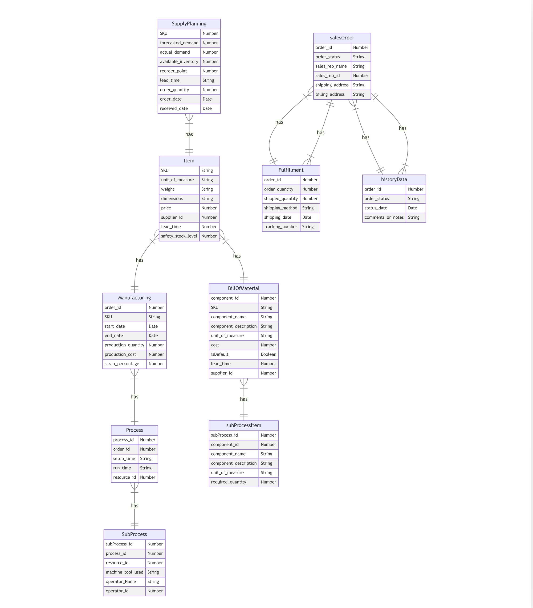

# AviaTech
# Aibus Aerothon-5.0 Hacathon round
# Washing Machine Manufacturing Data Management System
This is a data management system designed to streamline the process of manufacturing washing machines. It provides a centralized platform for different departments to manage their data related to logistics, supply chain, planning, execution, and forecasting of orders. The platform is designed to reduce redundancy, improve data authenticity, and make data management more sustainable in the long term.

## Tech Stack
The platform is built using the following technologies:

- React - front-end framework
- Node.js - back-end runtime environment
- MongoDB - database management system
- Express.js - web application framework for Node.js
- JWT - JSON Web Token for authentication

## Features
- `Data lake`: The platform has a normalized database that stores all the data related to the manufacturing process, from fabrication to assembly. The database is designed to reduce redundancy and improve data authenticity.

- `Redundant data identification`: The platform can identify redundant data from the forecasted data generated by different departments. This helps to reduce data duplication and ensure that only authentic data is used in the manufacturing process.

- `Real-time data approval`: The platform has an automation process for data stamping (approval) of the real-time data. This ensures that the data is authentic and up-to-date before it is used in the manufacturing process.

- `Domain-specific dashboard`: The platform has a dashboard for each department that allows users to access the data required for their domain. The dashboard provides a user-friendly interface for data management and visualization.

- `Data officer dashboard`: The platform has a dashboard for the data officer to monitor the data stamping process. The data officer can track the progress of data approval and ensure that all data used in the manufacturing process is authentic.

## Getting Started
### Prerequisites
- Node.js installed
- MongoDB installed

### Installation
1. Clone the repository
2. Navigate to the root directory
3. Run npm install
4. Create a .env file with the following environment variables:
```
PORT=3000
MONGO_URI=<your_mongodb_uri>
JWT_SECRET=<your_jwt_secret>
```
5. Run npm start

### Deployment
- AWS

### Architecture
Use Case Diagram\


Data Flow Diagram\


### ER Diagram

ER Diagram

## Data Lake
The data lake is a centralized repository that stores all the data from different sources in its raw format. It is a scalable and cost-effective solution that allows businesses to store, process, and analyze large volumes of structured, semi-structured, and unstructured data.

Our data lake is designed to reduce redundancy in the system and ensure data authenticity. We have created a normalized database with the following tables:

- `Item Table`\
The Item table is the primary table that stores information about the washing machine models, including the SKU and Supplier ID.

- `Manufacturing Table`\
The Manufacturing table stores the Order ID and SKU for each washing machine that is being manufactured.

- `BillOfMaterial Table`\
The BillOfMaterial table stores the Component ID, SKU, and Supplier ID for each washing machine component.

- `Process Table`\
The Process table stores the Process ID, Order ID, and Resource ID for each manufacturing process.

- `Subprocess Table`\
The Subprocess table stores the Subprocess ID, Process ID, Resource ID, and Operator ID for each manufacturing subprocess.

- `SubprocessItem Table`\
The SubprocessItem table stores the Subprocess ID and Component ID for each manufacturing subprocess item.

- `SalesOrder Table`\
The SalesOrder table stores the Order ID and Sales Rep ID for each washing machine sales order.

- `Fulfillment Table`\
The Fulfillment table stores the Order ID and Fulfillment Status for each washing machine sales order.

- `HistoryData Table`\
The HistoryData table stores the Order ID, Order Status, and Status Date for each washing machine sales order.

- `SupplyPlanning Table`\
The SupplyPlanning table stores the SKU for each washing machine model.

Our data lake is designed to be easily accessible through a dashboard that allows users to access the data required for their domain, including forecasted and real-time data. The dashboard also allows for data stamping (approval) of real-time data and provides a monitoring dashboard for the data officer to oversee the stamping process.

The solution is built using the latest open source technologies, including React for the frontend, MongoDB for the backend, and hosted on a cloud platform for scalability and performance. The platform has authentication and authorization for users based on their department and level of access. Overall, our data lake solution meets the requirements stated in the problem statement and is fully functional for users with a focus on sustainability and reducing redundancy in the system.

### Contributors
- Maaitrayo Das (dasmaaitrayo@mail.com)
- Hrittik Garain (hrittikgarain@gmail.com)
- Ayan Roy (royayan20191@gmail.com)
- Kunal Roy (roykuntal13@gmail.com | roykuntal1213@gmail.com )
- Sandeep Mandal (sandeepmandal0504@gmail.com)

### License
This project is licensed under the MIT License - see the [LICENSE.md](LICENSE.md) file for details.


